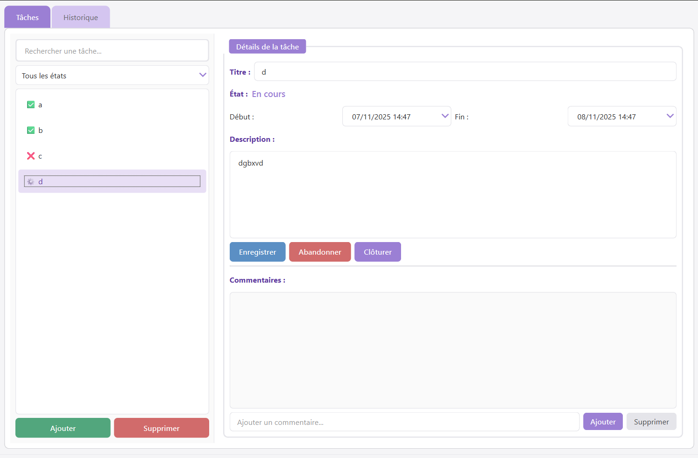

# PyTasks - Explications du Projet

## 📋 Table des matières

0. [Installation et utilisation](#-installation-et-utilisation)
1. [Architecture MVC](#1-architecture-mvc)
2. [Organisation des fichiers](#2-organisation-des-fichiers)
3. [Choix techniques](#3-choix-techniques)
4. [Validation et gestion des erreurs](#4-validation-et-gestion-des-erreurs)
5. [Interface utilisateur](#5-interface-utilisateur)
6. [Difficultés rencontrées et solutions](#6-difficultés-rencontrées-et-solutions)
7. [Améliorations et extensions](#7-améliorations-et-extensions)

---

## 📦 Installation et utilisation

### Prérequis

- Python 3.10 ou supérieur
- pip

### Installation
```bash
# Cloner le projet
git clone https://github.com/FLXwkg/PyTasks.git
cd pytasks

# Installer les dépendances
pip install -r requirements.txt
```

### Lancement
```bash
# Générer l'UI (si modifications du .ui)
pyside6-uic views/ui/main.ui -o views/ui_main.py

# Lancer l'application
python main.py
```

### Utilisation

1. Créer des tâches avec le bouton "Ajouter"
2. Rechercher et filtrer dans la sidebar
3. Sélectionner une tâche pour voir les détails
4. Utiliser les boutons contextuels selon l'état
5. Consulter l'historique dans l'onglet dédié

---

## 👨‍💻 Contexte

Projet réalisé dans le cadre d'un exercice d'apprentissage de PySide6.

**Date** : Novembre 2025  
**Technologies** : Python 3.13, PySide6 6.7.0, Qt Designer

---
## 1. Architecture MVC

### 1.1 Description du pattern MVC appliqué

PyTasks implémente le pattern **Model-View-Controller** pour séparer clairement les responsabilités et faciliter la maintenance et l'évolution du code.
```
┌─────────────┐          ┌──────────────┐         ┌─────────────┐
│    VIEW     │────────▶│  CONTROLLER  │────────▶│    MODEL    │
│  (UI Qt)    │◀────────│   (Logique)  │◀────────│  (Données)  │
└─────────────┘          └──────────────┘         └─────────────┘
   Affichage,              Coordination,           Persistance
   Événements             Validation                
```

### 1.2 Rôles détaillés

#### 🎯 Modèles (`models/`)
**Responsabilité** : Représentation des données et logique métier

- **`task.py`** : 
  - Classe `Task` avec tous les attributs (id, titre, description, dates, état, commentaires)
  - Enum `TaskState` pour les 5 états possibles
  - Validation métier (dates cohérentes, titre obligatoire)
  - Méthodes métier : `update()`, `close_task()`, `start_task()`, `add_comment()`
  - Sérialisation/désérialisation JSON (`to_dict()`, `from_dict()`)

- **`comment.py`** :
  - Classe `Comment` simple avec contenu et date de création
  - Validation du contenu non vide
  - Sérialisation JSON

- **`task_repository.py`** :
  - Pattern Repository pour isoler la persistance
  - CRUD complet (Create, Read, Update, Delete)
  - Recherche et filtrage par titre et état
  - Gestion robuste des erreurs (fichier corrompu, tâches invalides)

#### 🎨 Vues (`views/`)
**Responsabilité** : Affichage et capture des interactions utilisateur

- **`ui/main.ui`** :
  - Fichier XML Qt Designer décrivant l'interface
  - 2 onglets : Tâches (principal) et Historique
  - Sidebar avec recherche, filtres et liste
  - Panneau détails avec formulaire complet
  - Tous les boutons d'actions

- **`ui_main.py`** :
  - Généré automatiquement par `pyside6-uic`
  - Classe `Ui_MainWindow` avec méthode `setupUi()`
  - Ne jamais modifier manuellement

- **`main_window.py`** :
  - Classe `MainWindow` héritant de `QMainWindow`
  - Connexion des signaux Qt aux méthodes
  - Mise à jour de l'interface selon les données
  - **Aucune logique métier** : délègue tout au contrôleur
  - Gestion de l'affichage conditionnel des boutons
  - Validation visuelle en temps réel (modale de création)

#### 🎮 Contrôleur (`controllers/`)
**Responsabilité** : Orchestration entre vues et modèles

- **`task_controller.py`** :
  - Classe `TaskController` héritant de `QObject` (pour les signaux Qt)
  - Reçoit les événements de la vue
  - Appelle les méthodes des modèles
  - Valide les données
  - Gère les erreurs et affiche les messages
  - Émet des signaux (`tasks_updated`, `task_selected`) pour notifier la vue
  - Logue toutes les actions dans l'historique

### 1.3 Justification du découpage

#### ✅ Avantages de cette architecture

1. **Séparation des responsabilités** :
   - Les modèles ne connaissent pas l'UI
   - Les vues ne connaissent pas la persistance
   - Le contrôleur fait le lien

2. **Testabilité** :
   - Les modèles peuvent être testés sans UI
   - La logique métier est isolée

3. **Évolutivité** :
   - Changement de stockage (JSON → SQLite) : modifier seulement `task_repository.py`
   - Changement d'UI (PySide6 → PyQt6) : modifier seulement les vues
   - Ajout de fonctionnalités : ajouter méthodes au contrôleur

4. **Maintenabilité** :
   - Code organisé et facile à naviguer
   - Chaque fichier a un rôle clair
   - Réutilisabilité des composants

---

## 2. Organisation des fichiers

### 2.1 Structure complète du projet
```
pytasks/
├── main.py                      # Point d'entrée de l'application
├── main_window.py               # Vue principale (fenêtre + connexions)
├── styles.qss                   # Feuille de style CSS pour l'UI
├── requirements.txt             # Dépendances Python
├── tasks.json                   # Base de données JSON (généré auto)
├── history.log                  # Fichier de logs persistants (généré auto)
├── EXPLICATIONS.md              # Ce fichier
│
├── models/                      # 📦 Couche Modèle
│   ├── __init__.py
│   ├── task.py                  # Modèle Task + TaskState enum
│   ├── comment.py               # Modèle Comment
│   └── task_repository.py       # Repository (persistance JSON)
│
├── views/                       # 🎨 Couche Vue
│   ├── __init__.py
│   ├── ui_main.py               # Interface générée (ne pas modifier)
│   └── ui/
│       └── main.ui              # Fichier Qt Designer (XML)
│
├── controllers/                 # 🎮 Couche Contrôleur
│   ├── __init__.py
│   └── task_controller.py       # Contrôleur principal
│
└── utils/                       # 🔧 Utilitaires
    ├── __init__.py
    └── logger.py                # Système de logs persistants
```

### 2.2 Rôle détaillé de chaque fichier

#### 📄 Racine

| Fichier | Rôle |
|---------|------|
| `main.py` | Point d'entrée. Initialise QApplication, charge les styles, crée les composants (repository, logger, controller, window) et lance la boucle d'événements |
| `main_window.py` | Vue principale. Charge l'UI, connecte tous les signaux, affiche les données, gère les interactions utilisateur |
| `styles.qss` | Feuille de style CSS pour personnaliser l'apparence (thème violet lavande) |
| `requirements.txt` | Liste des dépendances : `PySide6==6.7.0` |
| `tasks.json` | Stockage JSON des tâches (généré automatiquement) |
| `history.log` | Fichier texte des logs persistants (généré automatiquement) |

#### 📦 `models/`

| Fichier | Rôle |
|---------|------|
| `task.py` | Définit la classe `Task` et l'enum `TaskState`. Contient toute la logique métier : validation, méthodes de modification, sérialisation |
| `comment.py` | Définit la classe `Comment`. Simple mais avec validation du contenu |
| `task_repository.py` | Pattern Repository. Isole la logique de persistance. Gère le chargement, la sauvegarde, la recherche et la suppression |

#### 🎨 `views/`

| Fichier | Rôle |
|---------|------|
| `ui/main.ui` | Fichier XML créé avec Qt Designer. Décrit visuellement l'interface (widgets, layouts, propriétés) |
| `ui_main.py` | Code Python généré par `pyside6-uic` depuis `main.ui`. Contient la classe `Ui_MainWindow` |

#### 🎮 `controllers/`

| Fichier | Rôle |
|---------|------|
| `task_controller.py` | Contrôleur principal. Reçoit les événements de la vue, manipule les modèles via le repository, émet des signaux, gère les erreurs |

#### 🔧 `utils/`

| Fichier | Rôle |
|---------|------|
| `logger.py` | Classe `Logger` pour enregistrer toutes les actions dans un fichier `history.log` avec timestamps |

---

## 3. Choix techniques

### 3.1 Stockage des données : JSON

**Choix** : Fichier JSON local (`tasks.json`)

**Justification** :
- ✅ **Simplicité** : Pas de serveur, pas de configuration
- ✅ **Lisibilité** : Format texte facilement éditable
- ✅ **Portabilité** : Fonctionne partout sans dépendances
- ✅ **Adapté au projet** : Pour <10 000 tâches, performance suffisante
- ✅ **Persistence** : Les données survivent à la fermeture de l'app

**Limitations connues** :
- ❌ Pas de transactions atomiques
- ❌ Performance limitée avec beaucoup de données
- ❌ Pas de requêtes SQL complexes

**Alternative envisagée** : SQLite serait plus robuste pour un projet de production.

### 3.2 Représentation des tâches

#### Structure d'une tâche
```python
Task {
    id: str (UUID)                    # Identifiant unique
    title: str                        # Titre (obligatoire)
    description: str                  # Description (optionnel)
    start_date: datetime | None       # Date de début (optionnel)
    end_date: datetime | None         # Date de fin (optionnel)
    state: TaskState (enum)           # État actuel (obligatoire)
    waiting_for: str | None           # ID de la tâche dépendante
    comments: List[Comment]           # Liste des commentaires
    created_at: datetime              # Date de création
    updated_at: datetime              # Dernière modification
}
```

#### États possibles (TaskState)
```python
class TaskState(Enum):
    TODO = "À faire"           # Tâche prête à être démarrée
    IN_PROGRESS = "En cours"   # Travail en cours
    DONE = "Réalisé"          # Terminée avec succès
    ABANDONED = "Abandonné"    # Abandonnée
    WAITING = "En attente"     # En attente d'une dépendance
```

#### Workflow des états
```
En attente → À faire → En cours → Réalisé
     ↓          ↓          ↓
     └──────> Abandonné <─┘
```

### 3.3 Représentation des commentaires
```python
Comment {
    id: str (UUID)           # Identifiant unique
    content: str             # Contenu (obligatoire, non vide)
    created_at: datetime     # Date de création
}
```

**Choix** : Les commentaires sont immuables (pas de modification après création) pour garder un maximum d'informations.

### 3.4 Gestion des relations

**Relation Task → Comments** : Composition (1-N)
- Les commentaires sont stockés **dans** la tâche (liste)
- Suppression d'une tâche → suppression de tous ses commentaires
- Sérialisation : commentaires inclus dans le JSON de la tâche

**Relation Task → Task (dépendances)** : Association faible
- Champ `waiting_for` contient l'ID de la tâche dépendante
- Pas de contrainte d'intégrité stricte (pour simplicité)
- Vérification à l'affichage (bouton "Démarrer" grisé si dépendance non satisfaite)

### 3.5 Fonctionnement de la clôture
```python
def close_task(self):
    self.state = TaskState.DONE
    now = datetime.now()
    
    # Ajuste les dates si nécessaires
    if not self.end_date or self.end_date > now:
        self.end_date = now
    
    if self.start_date and self.start_date > now:
        self.start_date = now
    
    self.updated_at = now
```

**Effets** :
1. État → `DONE`
2. `end_date` → maintenant (si absente ou dans le futur)
3. `start_date` → maintenant (si dans le futur, pour cohérence)
4. Verrouillage de tous les champs sauf commentaires
5. Tous les boutons d'action désactivés

**Pourquoi ajuster les dates ?**
- Évite les erreurs de validation (`end_date` < `start_date`)
- Cohérence : une tâche clôturée maintenant ne peut pas avoir une date de fin future

---

## 4. Validation et gestion des erreurs

### 4.1 Validations au niveau du modèle

#### Classe `Task`
```python
# Validation du titre (constructeur + update)
if not title or not title.strip():
    raise ValueError("Le titre est obligatoire")

# Validation des dates
def _validate_dates(self):
    if self.start_date and self.end_date:
        if self.end_date < self.start_date:
            raise ValueError("Date de fin avant date de début")
```

#### Classe `Comment`
```python
if not content or not content.strip():
    raise ValueError("Le contenu du commentaire ne peut pas être vide")
```

### 4.2 Validations au niveau du contrôleur

Le contrôleur attrape les exceptions des modèles et affiche des messages clairs :
```python
try:
    task.update(title=title, ...)
    self.repository.save(task)
    return True
except ValueError as e:
    self._show_error(f"Validation échouée : {str(e)}")
    return False
except Exception as e:
    self.logger.log("error", f"Erreur : {str(e)}")
    self._show_error(f"Erreur : {str(e)}")
    return False
```

### 4.3 Validations au niveau de la vue

#### Modale de création : Validation en temps réel
```python
def validate_form():
    has_title = bool(title_input.text().strip())
    dates_valid = end_date >= start_date
    
    if state == WAITING:
        has_dependency = waiting_select.currentData() is not None
    else:
        has_dependency = True
    
    is_valid = has_title and dates_valid and has_dependency
    btn_create.setEnabled(is_valid)
    
    # Feedback visuel (bordures rouges)
    if not has_title:
        title_input.setStyleSheet("border: 1px solid #ff6b6b;")
```

**Avantage** : L'utilisateur voit immédiatement ce qui est invalide, le bouton "Créer" reste désactivé tant que le formulaire est incomplet.

#### Autres validations UI

- Bouton "Supprimer" désactivé si aucune tâche sélectionnée
- Bouton "Démarrer" grisé si dépendance non satisfaite
- Champs en lecture seule si tâche clôturée/abandonnée
- Sélecteur de dépendance désactivé après création

### 4.4 Comportement en cas d'erreurs

#### Erreurs de validation
```
QMessageBox.critical(
    "Erreur de validation",
    "La date de fin doit être après la date de début !"
)
```

#### Erreurs de chargement
```python
def load_all(self):
    try:
        # Charge le JSON
    except json.JSONDecodeError:
        return []  # Fichier corrompu → liste vide
    except Exception as e:
        raise IOError(f"Erreur : {str(e)}")
```

Si une tâche individuelle est corrompue, elle est ignorée (avec warning en console) mais les autres sont chargées.

#### Erreurs réseau/fichier

- Fichier `tasks.json` manquant → créé automatiquement
- Fichier `history.log` manquant → créé automatiquement
- Permissions insuffisantes → message d'erreur clair

---

## 5. Interface utilisateur

### 5.1 Principes de conception

#### 🎨 Design System

**Thème** : Violet lavande élégant avec couleurs pastel

**Palette** :
- Violet principal : `#9b7fd4` (actions principales, focus)
- Vert : `#52a67d` (actions positives : commencer, ajouter)
- Bleu : `#5b8fc4` (enregistrer)
- Rouge : `#d16b6b` (danger : abandonner, supprimer)
- Gris : `#f5f5f7` (fond), `#e5e5ea` (bordures)

**Principes** :
- Couleurs douces et reposantes
- Contraste suffisant pour la lisibilité
- Feedback visuel sur toutes les interactions
- États désactivés clairement identifiables

#### 📐 Layout


### 5.2 Navigation et interactions

#### Workflow principal

1. **Recherche/Filtrage** :
   - Barre de recherche → recherche en temps réel dans les titres
   - ComboBox filtres → filtre par état
   - Les deux peuvent être combinés

2. **Sélection d'une tâche** :
   - Clic sur une tâche dans la liste
   - Panneau détails s'affiche à droite
   - Boutons adaptés à l'état de la tâche

3. **Création de tâche** :
   - Clic "Ajouter"
   - Modale avec validation en temps réel
   - Tâche créée → sélection automatique

4. **Modification de tâche** :
   - Édition des champs
   - Clic "Enregistrer"
   - Confirmation en barre de statut

5. **Gestion du cycle de vie** :
   - Boutons contextuels selon l'état
   - Workflow guidé : En attente → À faire → En cours → Réalisé
   - Possibilité d'abandonner à tout moment

#### Gestion des commentaires

- **Ajout** : Champ texte + bouton (ou Entrée)
- **Affichage** : Liste avec timestamp
- **Suppression** : Sélection multiple (Ctrl/Shift) + bouton
- **Confirmation** : Popup si 1 commentaire, sinon juste le nombre

#### Gestion spécifique de la clôture

**Popup de confirmation** :
```
┌────────────────────────────────────┐
│ Clôturer la tâche                  │
├────────────────────────────────────┤
│ Clôturer 'Ma tâche' ?              │
│                                    │
│ Actions effectuées :               │
│ • État changé en 'Réalisé'         │
│ • Date de fin → maintenant         │
│ • Champs verrouillés               │
│                                    │
│ Les commentaires resteront         │
│ accessibles.                       │
│                                    │
│          [Non]  [Oui]              │
└────────────────────────────────────┘
```

**Après clôture** :
- Tous les champs passent en lecture seule (grisés)
- Seuls les commentaires restent accessibles
- Plus aucun bouton d'action disponible
- Icône ✅ dans la liste

### 5.3 Fonctionnalités avancées

#### Dépendances entre tâches

- Sélection à la création si état = "En attente"
- Liste filtrée (exclut Abandonnées et Réalisées)
- Recherche dans la liste
- Bouton "Démarrer" grisé si dépendance non satisfaite
- Tooltip explicatif

#### Historique persistant

- Onglet dédié
- Format console : `[date] [LEVEL] message`
- Sauvegarde automatique dans `history.log`
- Bouton pour effacer (avec confirmation)

---

## 6. Difficultés rencontrées et solutions

### 6.1 Problème 1 : Layouts imbriqués dans Qt Designer

**Problème** : Erreur `RuntimeWarning: Can't find type resolver for type 'class QWidgetItemV2'` lors de l'ajout de layouts dans layouts.

**Cause** : Qt ne peut pas ajouter directement un layout dans un autre layout via `.addLayout()` dans certains cas.

**Solution** :
```xml
<!-- Avant (erreur) -->
<layout class="QHBoxLayout" name="buttonLayout">
  <item><widget>...</widget></item>
</layout>

<!-- Après (ok) -->
<widget class="QWidget" name="buttonContainer">
  <layout class="QHBoxLayout" name="buttonLayout">
    <item><widget>...</widget></item>
  </layout>
</widget>
```

Envelopper le layout dans un conteneur `QWidget` résout le problème.

### 6.2 Problème 2 : Emojis dans les fichiers .ui

**Problème** : L'application plantait silencieusement au chargement de l'UI.

**Cause** : Les emojis dans les propriétés `text` causent des problèmes d'encodage avec certaines versions de Qt.

**Solution** : Retirer **tous** les emojis du fichier `.ui`. Les ajouter dynamiquement dans le code Python si nécessaire.

### 6.3 Problème 3 : Validation des dates à la clôture

**Problème** : Erreur `ValueError: Date de fin avant date de début` lors de la clôture d'une tâche avec `start_date` dans le futur.

**Cause** : `close_task()` mettait `end_date` à `now()` sans vérifier `start_date`.

**Solution** :
```python
def close_task(self):
    now = datetime.now()
    
    # Ajuste end_date
    if not self.end_date or self.end_date > now:
        self.end_date = now
    
    # Ajuste start_date si future (pour cohérence)
    if self.start_date and self.start_date > now:
        self.start_date = now
```

### 6.4 Problème 4 : Gestion robuste du fichier JSON

**Problème** : Une seule tâche corrompue empêchait le chargement de **toutes** les tâches.

**Solution** : Boucle avec gestion d'erreur individuelle
```python
for task_data in data:
    try:
        task = Task.from_dict(task_data)
        tasks.append(task)
    except Exception as e:
        print(f"⚠️ Tâche ignorée : {e}")
        continue  # Continue avec les autres
```

### 6.5 Ce que j'aurais fait différemment

**Avec plus de temps** :

1. **Tests unitaires** :
   - Tests des modèles (validation, sérialisation)
   - Tests du repository (CRUD)
   - Tests du contrôleur (logique métier)

2. **SQLite au lieu de JSON** :
   - Meilleure performance
   - Transactions atomiques
   - Requêtes SQL avancées

3. **Drag & Drop** :
   - Réorganiser les tâches par drag & drop
   - Changer l'état en glissant vers des zones

4. **Export/Import** :
   - Exporter en CSV, PDF
   - Importer depuis d'autres formats

5. **Notifications** :
   - Rappels pour les tâches
   - Notifications desktop

---

## 7. Améliorations et extensions

### 7.1 Fonctionnalités bonus développées

#### ✅ Système de dépendances entre tâches

- Champ `waiting_for` pour lier les tâches
- Validation : impossible de démarrer si dépendance non satisfaite
- Feedback visuel (bouton grisé + tooltip)
- Logs clairs : "Tâche B en attente de Tâche A"

#### ✅ Historique persistant

- Classe `Logger` avec sauvegarde dans `history.log`
- Format structuré : `[timestamp] [LEVEL] message`
- Niveaux : INFO, WARNING, ERROR, SUCCESS
- Chargement automatique au démarrage

#### ✅ Suppression multiple de commentaires

- Sélection multiple (Ctrl/Shift)
- Bouton affiche "(X)" si plusieurs sélectionnés
- Confirmation adaptée
- Logs différents selon le nombre

#### ✅ Validation en temps réel

- Modale de création avec validation live
- Bouton "Créer" désactivé si formulaire invalide
- Feedback visuel (bordures rouges)
- Aucune popup d'erreur nécessaire

#### ✅ Thème personnalisé élégant

- Fichier `styles.qss` complet
- Palette violet lavande harmonieuse
- Couleurs équilibrées (ni trop vives, ni trop pâles)
- Feedback visuel sur toutes les interactions

### 7.2 Idées non réalisées

#### 🔮 Priorités et tags

- Ajouter un champ `priority` (Haute, Moyenne, Basse)
- Système de tags/labels (ex: "urgent", "bug", "feature")
- Filtrage par priorité/tags

#### 🔮 Statistiques et tableaux de bord

- Nombre de tâches par état (graphique en camembert)
- Temps moyen de réalisation
- Productivité par jour/semaine

#### 🔮 Sous-tâches

- Décomposer une tâche en sous-tâches
- Arborescence expandable
- Progression automatique (3/5 sous-tâches terminées)

#### 🔮 Recherche avancée

- Recherche dans les descriptions
- Recherche dans les commentaires
- Filtres multiples combinés
- Recherche par date

#### 🔮 Collaboration

- Mode multi-utilisateurs
- Assignation de tâches
- Commentaires avec auteur
- Synchronisation cloud

### 7.3 Réflexion personnelle

#### Ce projet m'a permis de :

1. **Maîtriser le pattern MVC** :
   - Comprendre la séparation des responsabilités
   - Apprécier la maintenabilité du code structuré

2. **Approfondir PySide6** :
   - Signaux/slots Qt
   - Qt Designer et génération de code
   - QSS (stylesheets)

3. **Gérer la complexité** :
   - États multiples avec transitions valides
   - Validation à plusieurs niveaux
   - Gestion d'erreurs robuste

4. **Penser UX** :
   - Validation en temps réel
   - Feedback visuel immédiat
   - Messages clairs et contextuels
   - Workflow guidé

#### Points forts du projet :

- ✅ Architecture propre et extensible
- ✅ Code bien documenté
- ✅ Gestion d'erreurs complète
- ✅ Interface élégante et intuitive
- ✅ Fonctionnalités bonus pertinentes

#### Ce que j'ai appris :

- L'importance de la validation à **tous les niveaux**
- Le pattern Repository pour isoler la persistance
- La gestion robuste des fichiers JSON corrompus
- L'équilibre entre simplicité et fonctionnalités

---
